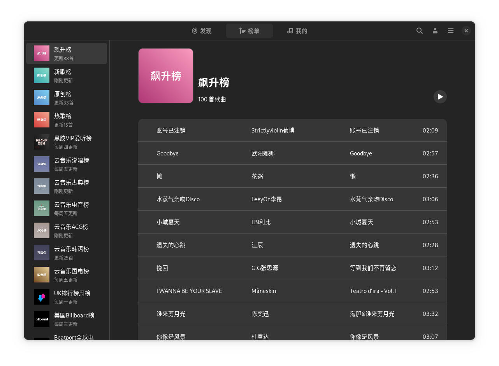

# NeteaseCloudMusicGtk4
> netease-cloud-music-gtk4 是基于 GTK4 + Libadwaita 构造的网易云音乐播放器，专为 Linux 系统打造，已在 openSUSE Tumbleweed + GNOME 环境下测试。

## 特点
- 稳定：专为 Linux 系统打造，相比官方版本拥有更好的兼容与稳定性。
- 极速：相比 Node/python 版，Rust + GTK 带给你如丝般的顺滑体验。
- 可靠：除了断网或网易 API 限制，不会出现运行时问题。
- 简洁：仿 GNOME Music 风格，GTK 原生界面，纯粹得令人发指。
- 轻量：安装文件不到 3 M，只需最简单的运行时依赖。

## 路线图
- [x] 发现页
- [x] 榜单页
- [x] 歌单详情页
- [x] 自适应皮肤
- [x] 网络代理
- [x] 扫码登录
- [x] 验证码登录
- [x] 播放栏
- [x] 多语言支持
- [x] 歌单页
- [x] 搜索页
- [x] 我的页
- [x] 首选项
- [x] Mpris2 绑定
- [x] 播放列表
- [x] 歌词
- [X] 桌面歌词(依赖于 [desktop-lyrics](https://github.com/tuberry/desktop-lyric) 或 osdlyrics)

## 运行依赖
> openssl, gstreamer, gstreamer-plugins-base, gstreamer-plugins-good, gstreamer-plugins-bad, gstreamer-plugins-ugly

## 安装
### openSUSE Tumbleweed
```bash
sudo zypper in netease-cloud-music-gtk
```
### openSUSE Leap
```bash
// 添加源
sudo zypper ar -f obs://multimedia:apps multimedia
// 安装
sudo zypper in netease-cloud-music-gtk
```

### Arch Linux
```bash
# AUR
paru -S netease-cloud-music-gtk4
# archlinuxcn repo
sudo pacman -Syu netease-cloud-music-gtk4
```

### Ubuntu(24.10/24.04/22.04)
```
# 添加 PPA 源
sudo add-apt-repository ppa:gmg137/ncm
# 刷新源
sudo apt update
# 安装
sudo apt install netease-cloud-music-gtk
```

### Debian
> [添加 Debian 中文社区软件源](https://github.com/debiancn/repo/blob/master/README.rst)
```
# 安装
sudo apt install netease-cloud-music-gtk
```

### Flatpak
#### 从 Flathub 安装
<a href='https://flathub.org/apps/com.github.gmg137.netease-cloud-music-gtk'>
    
</a>

#### 离线安装
```bash
sudo flatpak install com.gitee.gmg137.NeteaseCloudMusicGtk4-*.flatpak
```

### Nix
```bash
nix-env -iA nixpkgs.netease-cloud-music-gtk
```

### Gentoo Linux
```
// 添加gentoo-zh源
sudo emerge --ask app-eselect/eselect-repository
sudo eselect repository enable gentoo-zh
// 同步gentoo-zh源
sudo emerge --sync gentoo-zh
// 安装
sudo emerge --ask media-sound/netease-cloud-music-gtk
```

### 从源码安装(不推荐)
> 编译依赖: openssl、dbus、gtk4、gdk-pixbuf、libadwaita-1、gstreamer、gstreamer-base
```
// 安装依赖（Debian）
sudo apt-get install -y libssl-dev meson rustc libgtk-4-dev libadwaita-1-dev libgstreamer-plugins-bad1.0-dev

// 下载源码
git clone https://github.com/gmg137/netease-cloud-music-gtk.git
cd netease-cloud-music-gtk

// 编译
meson _build
cd _build
ninja

// 安装
sudo ninja install
```

## FAQ
1. 为什么后台运行时没有托盘图标?
> 由于 GTK3 开始取消了托盘接口，所以目前不打算实现托盘功能。<br>
> **替代方案:**
> - Mpris 插件: GNOME 推荐 [Media Controls](https://extensions.gnome.org/extension/4470/media-controls/)，其它桌面可查找相应 Mpris 插件。
> - 直接点击启动图标，亦可唤醒程序。
2. 使用 osdlyrics 时没有正确匹配歌词?
> 打开 osdlyrics 的[首选项]-[歌词位置]-[文件名]，添加匹配规则: %t-%p-%a。
3. 音乐缓存目录在什么位置?
> 缓存位于用户主目录下 .cache/netease-cloud-music-gtk4 文件夹内。
4. 如何分享音乐?
> 点击播放栏的歌曲名称，便会复制歌曲链接等信息到剪贴板。
5. 如何查看日志
> 从终端启动程序，添加环境变量 RUST_LOG=debug 或 RUST_LOG=netease_cloud_music_gtk4。

## 截图





## License
This project's source code and documentation is licensed under the  [GNU General Public License](COPYING) (GPL v3).

## 参考
- [Shortwave](https://gitlab.gnome.org/World/Shortwave)
- [gnome-music](https://gitlab.gnome.org/GNOME/gnome-music)
